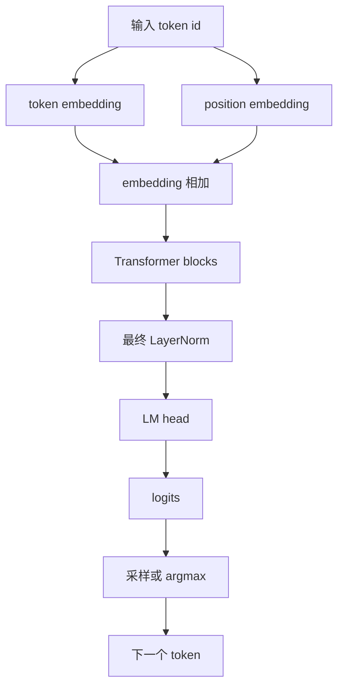
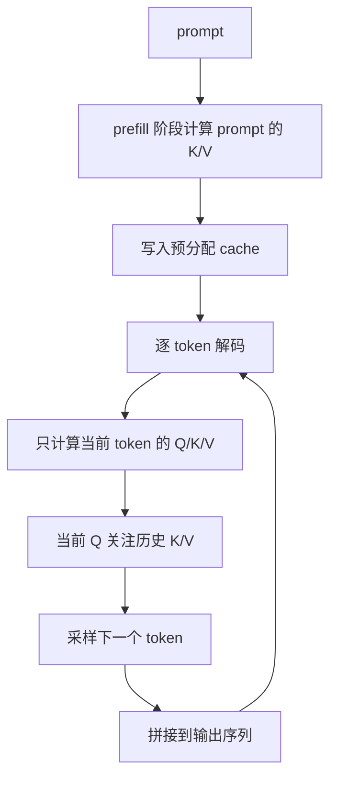

# GPT KV Cache 实验项目

本项目用于学习和验证 GPT 推理优化。项目从一个字符级 GPT 出发，逐步实现模型结构、logits 输出、采样、KV cache、静态批处理、padding、attention mask，并额外实现了一个可以加载 HuggingFace GPT-2 预训练权重的 GPT-2 版本。

项目重点不是训练一个大型语言模型，而是把 GPT 推理链路拆开，理解并验证以下内容：

- logits 如何变成最终 token
- greedy、temperature、top-k、top-p 采样如何实现
- KV cache 为什么能减少重复计算
- 静态批处理如何处理不等长输入
- padding 和 attention mask 如何接入 causal attention
- 自己实现的 GPT-2 如何加载 HuggingFace 权重并验证输出一致性
- KV cache 在不同 prompt 长度、生成长度和 batch size 下的性能收益

## 功能

- 字符级 GPT 基线模型
- 字符级 GPT KV cache 推理模型
- 兼容 HuggingFace GPT-2 权重的 GPT-2 实现
- greedy、temperature、top-k、top-p 采样
- 不等长 prompt 的静态批处理
- padding 和 attention mask
- 向量化多头注意力
- 延迟、吞吐量、加速比和显存占用测试

## 目录结构

```text
gpt/
|-- config.py                         # 字符级 GPT 配置
|-- model.py                          # 不带 KV cache 的字符级 GPT 基线模型
|-- model_kvcache.py                  # 带 KV cache 和批处理的字符级 GPT
|-- model_gpt2.py                     # 兼容 GPT-2 权重并支持 KV cache 的模型
|-- trained.py                        # 字符级 GPT 的训练、加载和生成入口
|-- test_inference.py                 # 简单推理测试
|-- load_hf_gpt2.py                   # 加载 HuggingFace GPT-2 权重并验证一致性
|-- benchmark.py                      # 字符级 GPT 的 no-cache 与 KV cache 性能测试
|-- benchmark_gpt2.py                 # GPT-2 的 no-cache 与 KV cache 性能测试
|-- input.txt                         # 训练语料，可选
|-- benchmark_char_latest.csv         # 字符级 GPT 最新测试结果
`-- benchmark_gpt2_prealloc_full.csv  # GPT-2 最新测试结果
```


## 环境安装

推荐使用 Python 3.10 或更高版本。如果要复现本文中的性能测试结果，建议使用支持 CUDA 的 PyTorch。

```bash
conda create -n nanogpt python=3.10
conda activate nanogpt
pip install -r requirements.txt
```

如果需要安装指定 CUDA 版本的 PyTorch，请先根据自己的显卡和 CUDA 版本安装 PyTorch，再安装其余依赖：

```bash
pip install transformers tqdm
```

## 快速开始

训练字符级 GPT：

```bash
python trained.py
```

运行简单推理测试：

```bash
python test_inference.py
```

运行字符级 GPT 的 KV cache 测试：

```bash
python benchmark.py --checkpoint gpt_model.pt --out benchmark_char_latest.csv
```

验证 HuggingFace GPT-2 权重加载：

```bash
python load_hf_gpt2.py
```

运行 GPT-2 的 KV cache 测试：

```bash
python benchmark_gpt2.py --repeats 2 --warmup 1 --generated-lengths 32,64,128,256 --prompt-lengths 64,128,256,512 --batch-sizes 1,2,4,8 --fixed-prompt-len 64 --fixed-new-tokens 64 --out benchmark_gpt2_prealloc_full.csv
```

## 模型流程

基础 GPT 前向传播流程：



带 KV cache 的生成流程：



## 当前配置

`config.py` 中的字符级 GPT 配置：

| 参数 | 当前值 |
| --- | ---: |
| `block_size` | `1024` |
| `batch_size` | `8` |
| `max_iters` | `20000` |
| `learning_rate` | `3e-4` |
| `n_embd` | `256` |
| `n_head` | `8` |
| `n_layer` | `6` |
| `dropout` | `0.2` |

GPT-2 实现对应 HuggingFace `gpt2` 的默认结构：

| 参数 | 当前值 |
| --- | ---: |
| `block_size` | `1024` |
| `n_layer` | `12` |
| `n_head` | `12` |
| `n_embd` | `768` |

## KV Cache 实现

`model_kvcache.py` 和 `model_gpt2.py` 都使用预分配式 KV cache：

```text
cache_k: [batch, n_head, max_cache_len, head_size]
cache_v: [batch, n_head, max_cache_len, head_size]
```

生成时先对 prompt 做 prefill，计算所有 prompt token 的 K/V 并写入 cache。之后每一步只输入最新 token，计算当前 token 的 Q/K/V，把新的 K/V 写入 cache，再让当前 Q 关注 cache 中的历史 K/V。

这种方式避免了每生成一个 token 都重新计算全部历史 token 的 K/V。

### GPT-2 的位置编码限制

GPT-2 使用 learned absolute position embedding，也就是学习得到的绝对位置编码。当上下文长度超过 `block_size=1024` 时，不能简单把 cache 左移后继续使用，因为 token 的绝对位置发生了变化，历史 K/V 理论上需要重新计算。

因此当前 GPT-2 实现会在 cache 满后，使用最近 1024 个 token 重建 cache。

## HuggingFace GPT-2 一致性验证

`load_hf_gpt2.py` 会把 HuggingFace GPT-2 的权重复制到本项目的 `model_gpt2.py` 中，并比较输出。

当前验证结果：

| 指标 | 结果 |
| --- | ---: |
| `max_abs_error` | `0.00004578` |
| `mean_abs_error` | `0.00001300` |
| `argmax_equal` | `True` |
| `pass_atol_0.0001` | `True` |
| `prefill_cache_max_abs_error` | `0.00004578` |
| `decode_cache_max_abs_error` | `0.00003815` |
| `local_generate_equal_kv` | `True` |

这些结果说明，本项目的 GPT-2 实现和 HuggingFace GPT-2 在浮点误差允许范围内保持一致。

## 性能测试结果

以下结果在 CUDA 上测试得到。完整结果保存在：

- `benchmark_char_latest.csv`
- `benchmark_gpt2_prealloc_full.csv`

表格中的 `mem` 表示 CUDA 峰值显存增量，单位为 MB。

### 字符级 GPT

生成长度变化：

| prompt | new tokens | no-cache | KV cache | 加速比 | KV tokens/s | mem no-cache -> KV |
| ---: | ---: | ---: | ---: | ---: | ---: | ---: |
| 64 | 64 | 0.9236s | 0.2407s | 3.84x | 265.88 | 2.1 -> 3.2 |
| 64 | 128 | 1.8158s | 0.4843s | 3.75x | 264.30 | 2.7 -> 3.9 |
| 64 | 256 | 3.5757s | 0.9036s | 3.96x | 283.30 | 3.9 -> 5.4 |
| 64 | 512 | 6.9395s | 1.8004s | 3.85x | 284.38 | 6.9 -> 8.4 |
| 64 | 1024 | 13.6609s | 4.2673s | 3.20x | 239.96 | 14.5 -> 84.3 |

prompt 长度变化：

| prompt | new tokens | no-cache | KV cache | 加速比 | KV tokens/s | mem no-cache -> KV |
| ---: | ---: | ---: | ---: | ---: | ---: | ---: |
| 64 | 64 | 0.9026s | 0.2305s | 3.92x | 277.65 | 2.1 -> 3.2 |
| 128 | 64 | 0.8933s | 0.2247s | 3.98x | 284.82 | 2.7 -> 4.9 |
| 256 | 64 | 0.8767s | 0.2229s | 3.93x | 287.14 | 3.9 -> 9.6 |
| 512 | 64 | 0.8380s | 0.2259s | 3.71x | 283.26 | 6.9 -> 26.5 |
| 1024 | 64 | 0.8078s | 0.7762s | 1.04x | 82.45 | 14.5 -> 84.3 |

batch size 变化：

| batch | prompt | new tokens | no-cache | KV cache | 加速比 | KV tokens/s | mem no-cache -> KV |
| ---: | ---: | ---: | ---: | ---: | ---: | ---: | ---: |
| 1 | 64 | 64 | 0.8827s | 0.2265s | 3.90x | 282.55 | 2.1 -> 3.2 |
| 2 | 64 | 64 | 0.8715s | 0.2239s | 3.89x | 571.69 | 3.2 -> 5.3 |
| 4 | 64 | 64 | 0.9053s | 0.2239s | 4.04x | 1143.38 | 5.7 -> 9.6 |
| 8 | 64 | 64 | 0.8980s | 0.2182s | 4.12x | 2346.65 | 11.3 -> 18.1 |
| 16 | 64 | 64 | 0.8377s | 0.2190s | 3.83x | 4675.85 | 22.6 -> 36.1 |

### GPT-2

生成长度变化：

| prompt | new tokens | no-cache | KV cache | 加速比 | KV tokens/s | mem no-cache -> KV |
| ---: | ---: | ---: | ---: | ---: | ---: | ---: |
| 64 | 32 | 0.2145s | 0.2280s | 0.94x | 140.33 | 37.1 -> 20.1 |
| 64 | 64 | 0.4135s | 0.3951s | 1.05x | 161.98 | 49.6 -> 22.3 |
| 64 | 128 | 1.0503s | 0.7900s | 1.33x | 162.02 | 74.7 -> 26.8 |
| 64 | 256 | 3.0050s | 1.5714s | 1.91x | 162.91 | 125.8 -> 35.8 |

prompt 长度变化：

| prompt | new tokens | no-cache | KV cache | 加速比 | KV tokens/s | mem no-cache -> KV |
| ---: | ---: | ---: | ---: | ---: | ---: | ---: |
| 64 | 64 | 0.4622s | 0.4412s | 1.05x | 145.06 | 49.6 -> 22.3 |
| 128 | 64 | 0.6517s | 0.4245s | 1.53x | 150.75 | 74.7 -> 39.2 |
| 256 | 64 | 1.0735s | 0.3958s | 2.71x | 161.71 | 125.8 -> 74.8 |
| 512 | 64 | 2.0737s | 0.3948s | 5.25x | 162.13 | 226.0 -> 146.8 |

batch size 变化：

| batch | prompt | new tokens | no-cache | KV cache | 加速比 | KV tokens/s | mem no-cache -> KV |
| ---: | ---: | ---: | ---: | ---: | ---: | ---: | ---: |
| 1 | 64 | 64 | 0.4722s | 0.3906s | 1.21x | 163.87 | 49.6 -> 22.3 |
| 2 | 64 | 64 | 0.7180s | 0.4430s | 1.62x | 288.91 | 98.9 -> 43.6 |
| 4 | 64 | 64 | 1.2657s | 0.4109s | 3.08x | 623.08 | 198.1 -> 92.9 |
| 8 | 64 | 64 | 2.4781s | 0.4126s | 6.01x | 1240.79 | 395.1 -> 174.1 |

## 结果分析

字符级 GPT 的 KV cache 加速比通常在 `3.7x` 到 `4.1x` 左右。原因是这个模型较小，no-cache 版本中重复计算历史 token 的 attention 开销占比较高，因此 KV cache 的收益更明显。

GPT-2 在短生成时加速不明显。例如生成 32 个 token 时，加速比为 `0.94x`。这是因为 GPT-2 更大，MLP 和大矩阵计算占据更多时间。短 decode 中，cache 管理和 kernel launch 开销会抵消一部分收益。

GPT-2 在长 prompt、长生成和大 batch 下收益更明显：

- 生成 256 个 token：`1.91x`
- prompt 长度 512：`5.25x`
- batch size 为 8：`6.01x`

同时 GPT-2 的显存收益很明显。例如生成 256 个 token 时，峰值显存增量从 `125.8 MB` 降到 `35.8 MB`。
